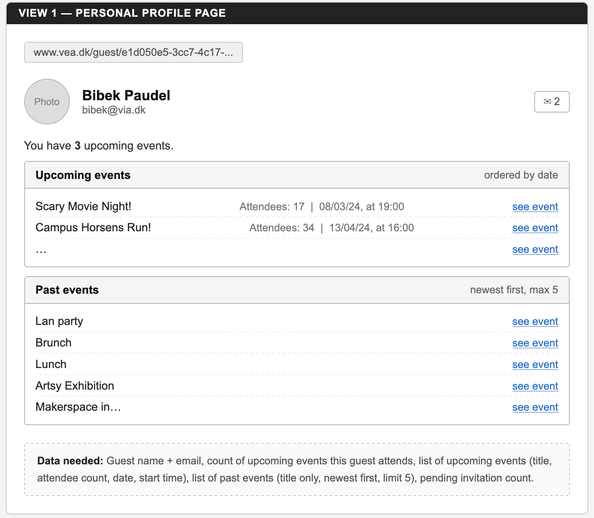
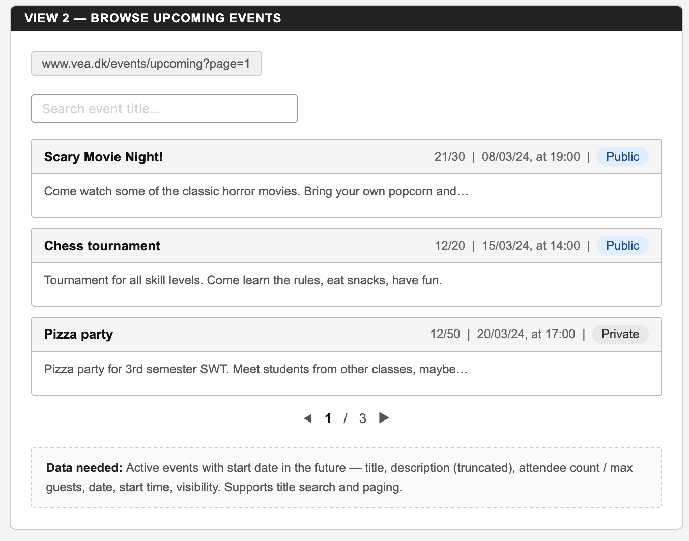
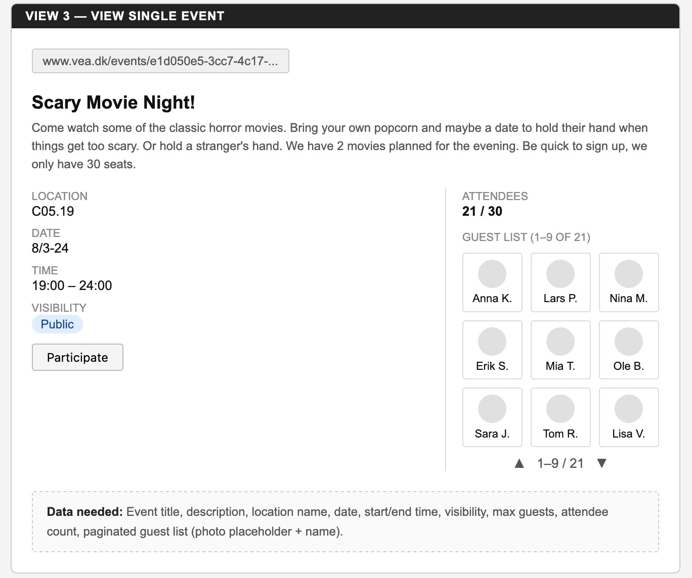
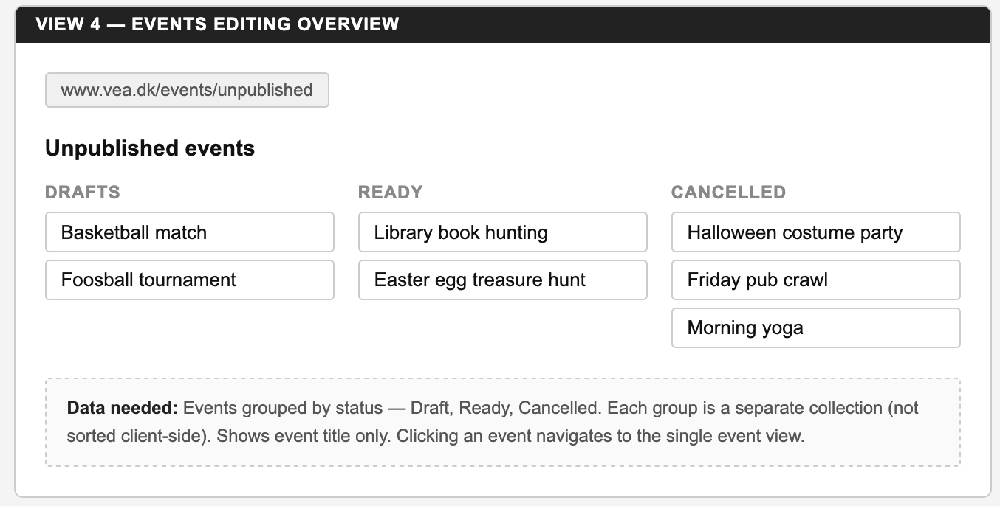
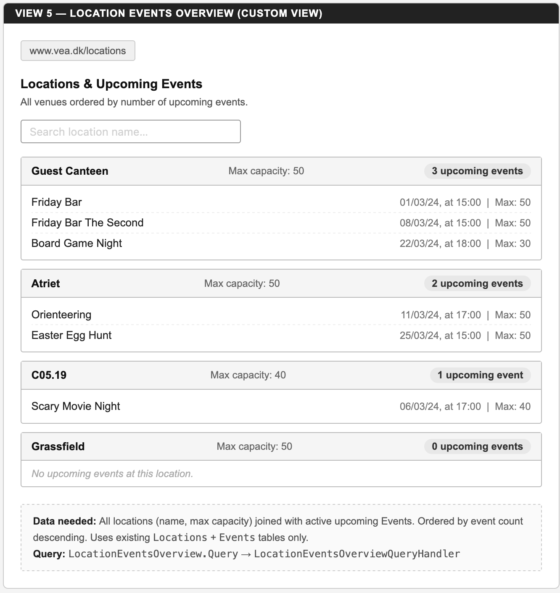

# Assignment 8 – Appendix A – View Designs

This document describes all UI views designed for Assignment 8.
Views 1–4 are from the assignment specification. View 5 is a custom view.

A full HTML sketch of all views is in `ViewDesigns.html` in this folder.

---

## View 1 – Personal Profile Page

### Description

This is the profile page a guest sees when viewing their own profile.

- Shows the guest's name and email.
- Shows a profile picture placeholder.
- Shows a count of upcoming events the guest is attending.
- Shows a list of upcoming events ordered by date (earliest first), each displaying:
  - Event title
  - Number of attendees
  - Date and start time
  - A link to the event
- Shows a list of past events — title only, newest first, limited to 5 entries.
- An envelope icon shows the number of pending invitations.

### Data needed

Guest name, email, profile picture. Upcoming events this guest participates in (title, attendee count, date, start time). Past events (title, ordered by end date descending, limit 5). Count of pending invitations.

---

## View 2 – Browse Upcoming Events

### Description

This page shows a paginated list of upcoming active events.

- A search bar filters events by title (contains match).
- Each event shows:
  - Event title
  - A short excerpt of the description
  - Attendee count out of max guests (e.g. 21/30)
  - Date and start time
  - Whether the event is Public or Private
- Pagination at the bottom shows current page and total pages (e.g. 1 / 3).
- Page size is variable, not fixed.
- Events are ordered by date, earliest first.
- Clicking an event navigates to the single event view.

### Data needed

Active events with start date/time in the future. Title, description (truncated), current attendee count, max guests, date, start time, visibility. Supports optional title search filter and paging (page number + page size).

---

## View 3 – View Single Event

### Description

This page shows full details for one specific event.

- Event title at the top, followed by the full description.
- Below: location name, date, time range, and visibility (Public / Private).
- On the right: attendee count out of max guests.
- A Participate button.
- A paginated guest list. Each guest shows a profile picture and name.
  - Paging scrolls one row at a time (e.g. viewing guests 1–9, next step shows 3–12).
- Clicking a guest navigates to that guest's profile page.

### Data needed

Event title, description, location name, start date, start time, end time, visibility, max guests, current attendee count. Paginated guest list (name, profile picture) — includes participants, accepted invitations, and accepted join requests.

---

## View 4 – Events Editing Overview

### Description

This is the event creator's management view. It shows three separate groups:

- **Drafts** — events still being edited
- **Ready** — events ready to be activated
- **Cancelled** — cancelled events

Each group lists just the event title. Groups are returned as separate collections from the server — the client does not sort or group them.

Clicking an event navigates to the single event view.

### Data needed

Events with status `draft`, `ready`, or `cancelled`. Title only per event. Three separate collections in the response — one per status group, each ordered by title.

---

## View 5 – Location Events Overview *(Custom View)*

### Description

This view shows all campus locations along with their upcoming active events. It helps guests browse events by venue.

- Each location is shown as a card with:
  - Location name
  - Maximum capacity
  - Count of upcoming active events
  - A list of those events, showing title, date, and start time
- Locations are ordered by upcoming event count (most active first).
- Locations with no upcoming events are shown at the bottom.
- A search bar allows filtering by location name.

### Data needed

All locations (name, max capacity). For each location: upcoming active events (status = active, start date/time in the future), showing event title, start date, start time, max guests. Uses only the existing `Locations` and `Events` tables — no additional tables required.

**Query:** `LocationEventsOverview.Query` → `LocationEventsOverviewQueryHandler`

